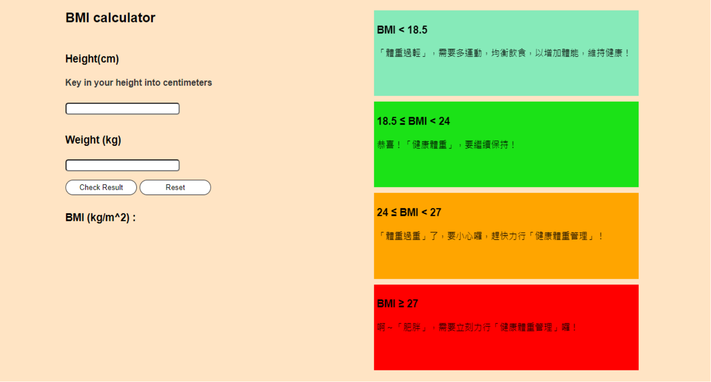
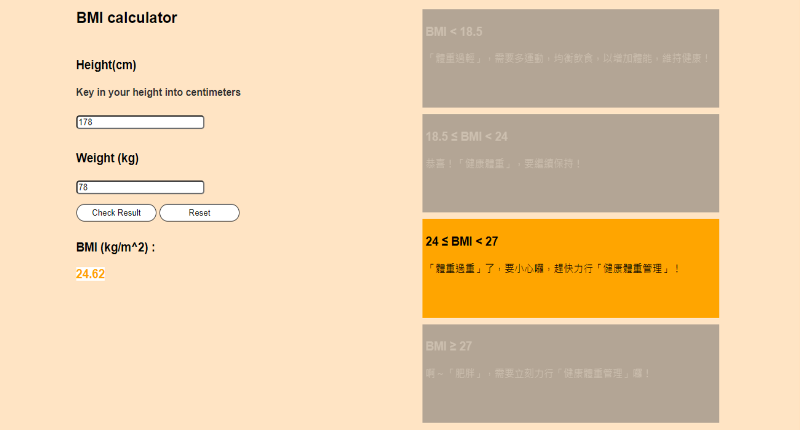
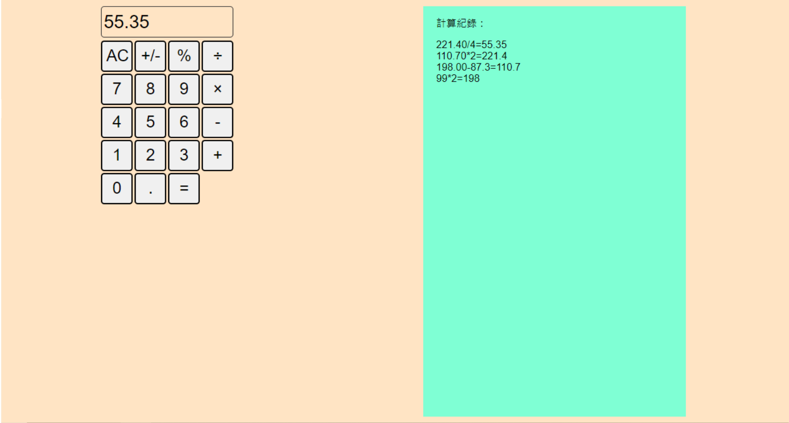
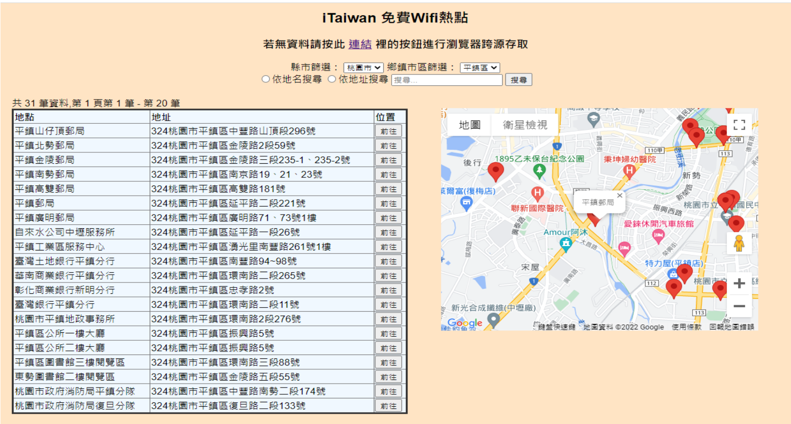
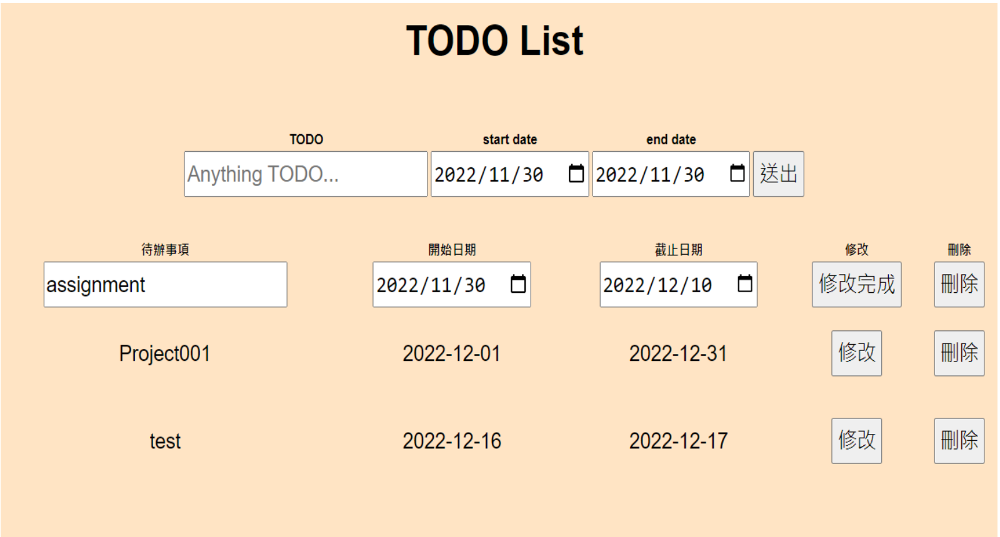
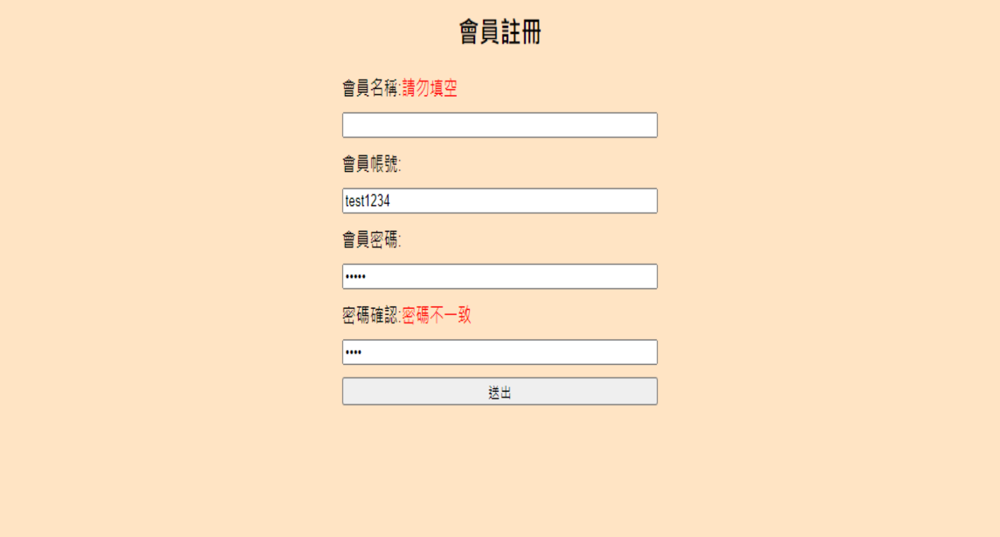
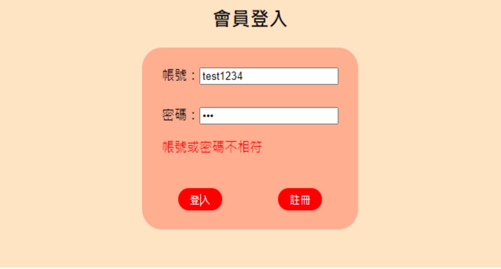
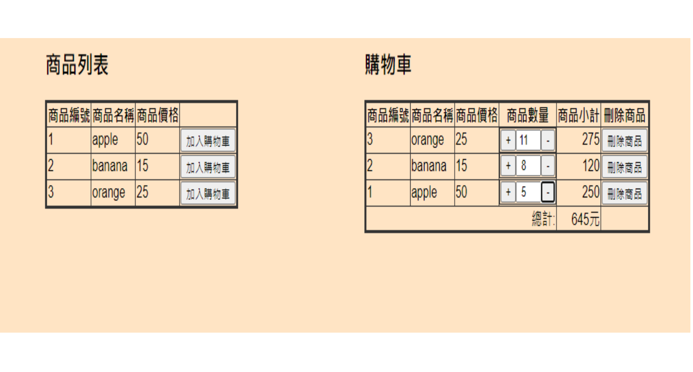

# Javascript & jQuery Practice
1. [BMI calculator](https://henry4682.github.io/Javascript-practice/BMI_calculator/)  
   
   
   功能：計算BMI  
   使用技術：jQuery, scss
2. [Calculator](https://henry4682.github.io/Javascript-practice/Calculator/)  
   
   功能：計算(加,減,乘,除,正負數切換)  
   使用技術：jQuery, scss
3. [Free Wifi Search](https://henry4682.github.io/Javascript-practice/Free_Wifi_Search/)  
   
   功能：搜尋、篩選(select)、限定搜尋(input type='radio')、讀取google maps api、重新定位  
   使用技術：jQuery, Ajax, scss, Google maps api, [cors-anywhere](https://github.com/Rob--W/cors-anywhere)
4. [TODO list](https://henry4682.github.io/Javascript-practice/TODO_List/)  
   
   功能：新增、修改、刪除TODO  
   使用技術：jQuery, scss
5. User Features  
   (1).[Register](https://henry4682.github.io/Javascript-practice/User/Register/)   
   
   功能：會員註冊、表單檢查(有無空白、密碼有無一致)  
   使用技術：jQuery, scss  
   (2).[LogIn](https://henry4682.github.io/Javascript-practice/User/LogIn/)   
   
   功能：會員登入、表單檢查(有無空白、帳號或密碼有無錯誤)  
   使用技術：jQuery, scss  
   (3).[Products&cart](https://henry4682.github.io/Javascript-practice/User/Products&cart/)  
   
   功能：商品清單呈現、加入購物車、個別商品小計和購物車總計計算、避免商品重複加入購物車、透過點擊按鈕或修改input調整商品數量、小計和總計、刪除購物車內商品並修改總計、 
   使用技術：jQuery, scss
6. [demo](https://henry4682.github.io/Javascript-practice/demo/)  
   